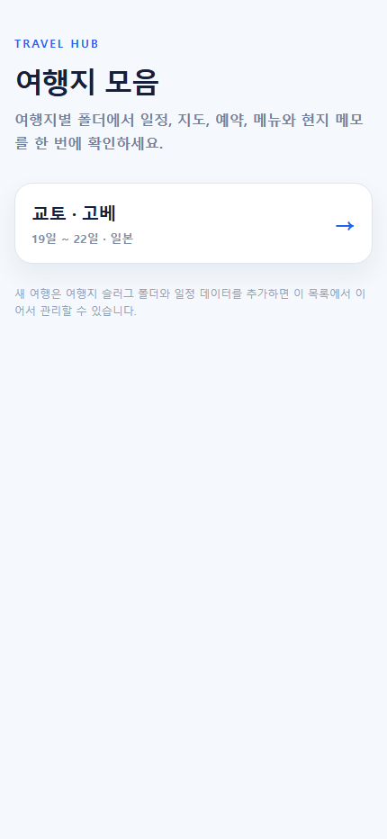
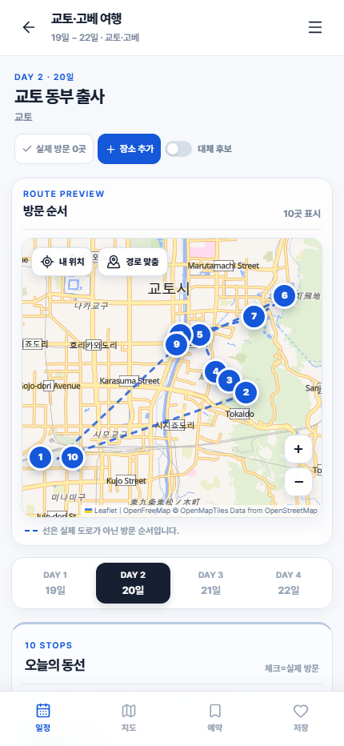
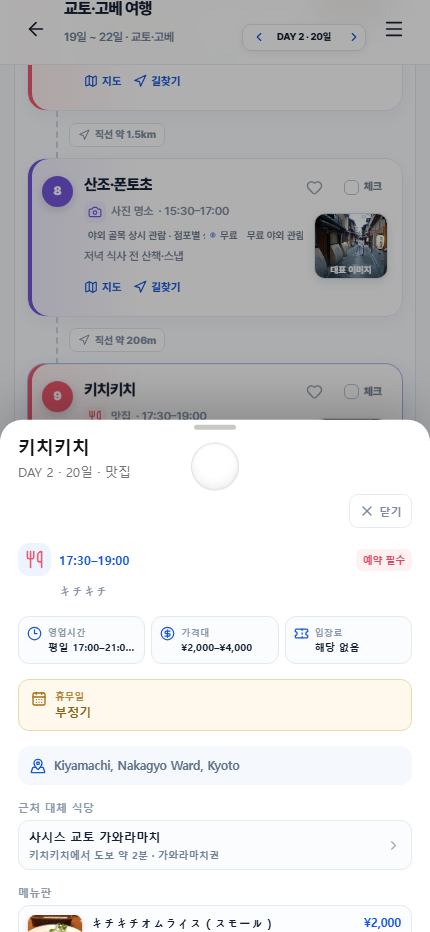
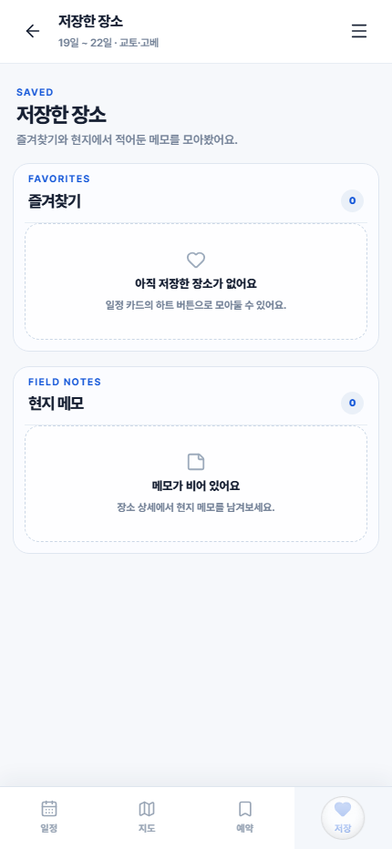

# Travel · 여행지 지도 모음

여행지별 폴더를 하나의 모바일 우선 정적 웹앱 허브에서 관리합니다. 현재는 `kyoto-kobe-trip/`에 19일부터 22일까지의 교토·고베 일정이 들어 있습니다.

[](#배포)
[](#현재-작업-완료-내역)
[](./kyoto-kobe-trip/trip.json)
[](./.github/workflows/deploy-pages.yml)

> [!TIP]
> 여행지·기간·숙소·가고 싶은 곳만 간단히 적어도 됩니다. AI가 부족한 주소·Google Maps 링크·영업시간·휴무일·가격·메뉴·대표 이미지를 조사하고, 확인하지 못한 값은 `확인 필요`로 남깁니다.

| 상태 | 현재 값 |
| --- | --- |
| **공개 URL 규칙** | `https://<github-id>.github.io/<repository-name>/` |
| **현재 여행** | `kyoto-kobe-trip/` · 교토·고베 19일~22일 |
| **구성** | 여행지별 `index.html` + `trip.json` |
| **배포** | `main` push → GitHub Actions → GitHub Pages |

---

## 빠른 이동

- [공개 여행지 허브 주소 규칙](#배포)
- [교토·고베 데이터](./kyoto-kobe-trip/trip.json)
- [복붙용 기본 프롬프트](#복붙용-기본-프롬프트)
- [여행 기록 공유·복원](#여행-기록-공유복원)
- [로컬 실행](#30초-만에-실행)
- [GitHub Pages 배포](#배포)
- [새 여행 추가 흐름](#새-여행-추가-흐름)
- [현재 구현·작업 내역](#현재-작업-완료-내역)
- [공통 UI 컴포넌트 계약](#공통-ui-컴포넌트-계약)
- [공통 UI 스킬](#공통-ui-스킬)
- [프롬프트 패키지](#프롬프트-패키지)
- [디자인 고정 규칙](#디자인-고정-규칙)
- [새 여행 입력 방법](#가장-쉬운-입력-방법-권장)
- [조사자료 받기용 프롬프트](#조사자료-받기용-프롬프트)
- [자동 조사·이미지 출처 규칙](#자동-조사-시-출처이미지-처리-규칙)
- [스킬·데이터 계약](#스킬과-문서)
- [실제 화면 미리보기](#실제-화면-미리보기)

---

## 30초 만에 실행

### 로컬에서 열기

```bash
npm install
npm run dev
```

브라우저에서 `http://localhost:5173/`을 열면 여행 허브가 표시됩니다. 포트가 다르면 터미널에 표시된 주소를 사용하세요.

### 배포된 앱 바로 열기

```text
로컬 허브       http://localhost:5173/
로컬 교토·고베  http://localhost:5173/kyoto-kobe-trip/
공개 허브       https://<github-id>.github.io/<repository-name>/
공개 교토·고베  https://<github-id>.github.io/<repository-name>/kyoto-kobe-trip/
```

---

## 폴더 구조

```text
index.html                 # 여행지 목록 허브
kyoto-kobe-trip/
  index.html               # 교토·고베 앱 진입점
  trip.json                # 여행지별 일정·장소 데이터
src/                       # 공통 모바일 앱 엔진
  travel-ui/
    components.tsx         # 모든 여행이 공유하는 헤더·카드·범례·시트·하단 메뉴
    types.ts               # Trip/Place/로컬 기록 공통 타입
    category.ts            # 카테고리 색상·한글 라벨·아이콘 공통 매핑
    index.ts               # 공통 UI·타입·카테고리의 단일 import 진입점
public/                    # 공통 디바이스·지도 자산
prompts/
  travel-plan-research.md  # 간단한 여행 정보 → travel-research.v1 조사자료
  travel-app-build.md      # 계획/조사자료 → 앱 생성·검수·선택적 배포
```

새 여행은 `<destination-slug>/index.html`과 `<destination-slug>/trip.json`을 추가하고, 루트 `index.html`에 여행지 카드를 연결합니다. 공통 UI는 `src/travel-ui/` 컴포넌트와 `src/prototype.css`를 재사용하고 여행별 내용은 각 폴더의 `trip.json`으로 분리합니다.

## 새 여행 추가 흐름

아래 순서만 따르면 기존 교토·고베 여행을 건드리지 않고 새 여행을 하나 더 만들 수 있습니다.

1. 이 저장소를 clone하고 `README.md`의 [가장 쉬운 입력 방법](#가장-쉬운-입력-방법-권장)에 여행지·기간·숙소·희망 장소만 적습니다.
2. AI에게 계획과 조사자료를 전달합니다. 장소명만 있거나 Google Maps 링크가 없어도 주소·지도 검색 링크·운영 정보를 조사하도록 요청할 수 있습니다.
3. AI가 기존 폴더와 겹치지 않는 `<destination-slug>/` 폴더, `index.html`, `trip.json`, 루트 허브 카드를 만듭니다.
4. `npm run validate:trip`, `npm run check:runtime`, `npm run build`, `npm run test:sites`로 생성 결과를 확인합니다.
5. 변경을 `main`에 push하면 GitHub Actions가 `dist/client`를 GitHub Pages에 배포합니다. 완료 후 허브에서 새 여행 카드를 열어 모바일 화면을 확인합니다.

여행별 URL은 일반 프로젝트 저장소 기준 `https://<github-id>.github.io/<repository-name>/<destination-slug>/` 형태입니다. 일정이 여러 개이면 각 여행 폴더의 `trip.json`만 별도로 관리하므로 한 여행의 장소 추가·삭제·실제 방문 체크가 다른 여행에 섞이지 않습니다.

---

## 배포

이 저장소는 특정 GitHub 계정에 종속되지 않는 GitHub Pages 정적 배포 템플릿입니다. 저장소를 fork하거나 `Use this template`으로 가져가면 각자의 계정과 저장소 이름에 맞춰 Pages 경로를 자동 계산합니다.

- 저장소: `https://github.com/<github-id>/<repository-name>`
- 일반 프로젝트 저장소 허브: `https://<github-id>.github.io/<repository-name>/`
- 사용자 페이지 저장소(`<github-id>.github.io`) 허브: `https://<github-id>.github.io/`
- 여행 앱: `https://<github-id>.github.io/<repository-name>/<destination-slug>/`
- 사용자 페이지 저장소의 여행 앱: `https://<github-id>.github.io/<destination-slug>/`
- Actions workflow: [`.github/workflows/deploy-pages.yml`](./.github/workflows/deploy-pages.yml)
- 빌드 결과: `dist/client`

복사한 저장소에서 최초 1회만 `Settings → Pages → Build and deployment → Source`를 `GitHub Actions`로 설정하세요. 이후 각자의 `main`에 push하거나 Actions의 `Deploy to GitHub Pages`를 수동 실행하면 본인 GitHub Pages에 빌드·배포됩니다.

### 저장소를 가져간 사람의 배포 순서

1. 이 저장소를 fork하거나 `Use this template`으로 본인 GitHub 계정에 복사합니다.
2. 복사한 저장소의 `Settings → Pages → Source`를 `GitHub Actions`로 설정합니다.
3. 여행 데이터를 바꾸고 `main`에 push합니다. 별도의 사용자명 수정이나 Vite 설정 수정은 필요하지 않습니다.
4. Actions가 끝나면 `https://<github-id>.github.io/<repository-name>/`에서 허브를 엽니다.

fork 저장소는 GitHub Actions가 기본적으로 꺼져 있을 수 있으므로 `Actions` 탭에서 workflow를 활성화한 뒤 실행하세요.

배포 전 확인:

1. 새 여행 폴더에 `<destination-slug>/index.html`과 `trip.json`이 있는지 확인합니다.
2. 루트 `index.html`에 새 여행 카드가 연결되어 있는지 확인합니다.
3. `npm run build`가 `dist/client`를 만드는지 확인합니다.
4. Actions의 `build`와 `deploy`가 모두 성공한 뒤 프로젝트 저장소는 `https://<github-id>.github.io/<repository-name>/<destination-slug>/`, 사용자 페이지 저장소는 `https://<github-id>.github.io/<destination-slug>/`를 엽니다.

`vite.config.ts`가 배포 환경의 `GITHUB_REPOSITORY`를 읽어 build base를 자동으로 정합니다.

- 일반 저장소: `/<repository-name>/`
- 사용자 페이지 저장소: `/`
- 로컬 개발: `/`
- 로컬에서 특정 프로젝트 경로를 미리 테스트할 때: `VITE_BASE_PATH=/my-repo/ npm run build` (PowerShell: `$env:VITE_BASE_PATH="/my-repo/"; npm run build`)

이미지·manifest·스크립트는 `import.meta.env.BASE_URL` 또는 상대 경로를 사용하므로 계정명과 저장소명이 달라도 깨지지 않습니다.

> [!IMPORTANT]
> GitHub 저장소의 `Settings → Pages → Source`는 최초 1회 `GitHub Actions`로 설정해야 합니다. `main` push 후 Actions의 `build`와 `deploy`가 모두 성공하기 전에는 공개 URL을 확정하지 마세요.

기본 기능:

- 지도: Leaflet + OpenFreeMap/OpenStreetMap
- 실제 길찾기: 장소별 Google Maps URL
- 여행 중 체크/즐겨찾기/메모: LocalStorage
- 오프라인: 서비스 워커가 앱 셸과 접속한 리소스를 캐시

Notion 토큰은 프론트 코드에 포함하지 않습니다. 여행 데이터는 각 여행지 폴더의 `trip.json` 정적 스냅샷으로 관리합니다.

---

## Clone·fork 후 같은 앱으로 시작하기

이 저장소는 코드·공통 컴포넌트·스킬·에이전트 지침을 함께 포함한 portable template입니다. 다른 사람이 clone, fork, 또는 `Use this template`으로 가져가도 원래 계정명이나 로컬 절대경로를 수정할 필요가 없습니다.

### 1. 저장소 복사와 초기 검증

```bash
git clone https://github.com/<github-id>/<repository-name>.git
cd <repository-name>
npm ci
npm run validate:trip
npm run check:runtime
npm run build
npm run dev
```

브라우저에서 `http://localhost:5173/`을 열고 기존 교토·고베 앱이 같은 헤더, 지도, 카테고리 카드, 상세 시트, 하단 메뉴로 보이는지 확인합니다. GitHub Pages는 저장소의 `GITHUB_REPOSITORY`를 읽어 각자의 경로를 자동으로 계산합니다.

### 2. 사용하는 에이전트와 스킬

| 도구 | 자동으로 읽는 파일 | 역할 |
| --- | --- | --- |
| Codex | `AGENTS.md` → `.agents/skills/travel-map-builder/SKILL.md` | 조사·데이터·새 여행까지 포함한 전체 작업 |
| Codex UI-only | `AGENTS.md` → `.agents/skills/travel-ui/SKILL.md` | 공통 UI·반응형·시각 회귀 수정 |
| Claude Code | `CLAUDE.md` → `.claude/skills/travel-map-builder/` 또는 `.claude/skills/travel-ui/` | canonical 스킬을 참조하는 동일 작업 |
| Gemini CLI | `GEMINI.md` → `.gemini/skills/travel-map-builder/` 또는 `.gemini/skills/travel-ui/` | canonical 스킬을 참조하는 동일 작업 |

세 환경 모두 `.agents/skills/travel-map-builder/`를 기준으로 하며, 다음 계약을 공유합니다.

- UI 구조: [`component-contract.md`](./.agents/skills/travel-map-builder/references/component-contract.md)
- 디자인: [`design-system.md`](./.agents/skills/travel-map-builder/references/design-system.md)
- 앱 데이터: [`trip-data-contract.md`](./.agents/skills/travel-map-builder/references/trip-data-contract.md)
- 조사자료 전달: [`research-packet.md`](./.agents/skills/travel-map-builder/references/research-packet.md)
- UI-only 스킬: [`.agents/skills/travel-ui/SKILL.md`](./.agents/skills/travel-ui/SKILL.md)

새 여행을 만들 때는 기존 여행을 덮어쓰지 않고 새 `<destination-slug>/`와 `trip.json`을 만들며, `src/travel-ui/`의 공통 컴포넌트를 그대로 사용합니다. 여행 폴더에 별도 dashboard, 헤더, 카드 JSX, 하단 메뉴, CSS를 만들지 않습니다.

---

## 현재 작업 완료 내역

현재 기준 여행은 19일~22일 교토·고베 일정이며, 총 4일·39개 장소가 `kyoto-kobe-trip/`에 들어 있습니다.

- 루트 여행 허브에서 여행지별 앱으로 이동합니다. 공개 주소는 저장소를 가져간 계정의 Pages 주소를 사용합니다.
- 교토·고베 앱은 `kyoto-kobe-trip/`에 독립적으로 보관되며, GitHub Pages에서는 `<destination-slug>` 경로로 열립니다.
- Leaflet + OpenFreeMap/OpenStreetMap 기반 한글 지도, 날짜별 경로 미리보기, 장소별 Google Maps 장소 보기·길찾기를 제공합니다.
- 일정 화면의 지도는 헤더 아래에 compact 높이로 고정되고, 현재 DAY·날짜와 이전/다음 이동 버튼은 여행 기간 옆 헤더(`.header-copy .header-meta`)에 표시합니다. 지도 자체에는 날짜 버튼을 겹쳐 놓지 않습니다. 일정 스크롤이 시작되면 지도는 route 요약만 남긴 작은 고정 바로 접혀 장소 카드가 가려지지 않습니다. 지도 마커를 누르면 상세 시트를 열지 않고 해당 장소 카드로 이동·강조하고 카드 본문을 눌렀을 때만 상세 정보를 엽니다.
- 숙소·사진 명소·맛집·카페·역·공항·짐 보관/이동을 아이콘·색상·범례로 구분하고, 지도 숫자 마커와 목록 번호에도 같은 카테고리 색상을 적용합니다.
- 카드와 상세 화면에 주소, 영업시간, 휴무일, 가격, 입장료, 예약 상태, 운영 메모를 표시합니다. 식당·카페의 휴무일은 별도 표시하며 확인하지 못한 값은 `확인 필요`로 표시합니다.
- 일본어 메뉴 아래에 한국어 번역과 가격을 병기하고, 메뉴별 음식 썸네일·장소 대표 이미지·지도 미리보기 폴백을 제공합니다.
- 기준 식당 주변의 대체 식당 후보, 예약 링크, 공식 정보·메뉴 원문 링크를 상세 화면에서 확인할 수 있습니다.
- 사용자가 지정한 사이트와 공식 페이지를 조사해 장소 정보의 원문 링크를 남기고, 안정적·허용된 대표 이미지 URL을 연결합니다. 이미지 출처가 불명확하면 지도/카테고리 폴백을 사용합니다.
- 실제 방문 체크, 즐겨찾기, 현지 메모, 장소 추가·수정·삭제, 실제 방문 장소만 보기, 새로고침 후 상태 유지를 지원합니다.
- 빠른 메뉴의 `데이터 내보내기`에서 수정·삭제·추가가 반영된 일정 스냅샷과 현재 여행 기록을 JSON으로 카카오톡/기기 공유·클립보드·파일 저장할 수 있고, `데이터 가져오기`에서 카카오톡에 보관한 JSON을 붙여넣거나 파일로 선택해 방문 체크·즐겨찾기·메모·예약 체크·장소 수정/삭제/추가를 복원합니다. 다른 여행 slug의 데이터는 잘못 적용되지 않도록 거부합니다.
- 모바일 헤더·카드·이미지·하단 내비게이션의 잘림과 상세 시트 내부 스크롤을 반응형으로 보정했습니다. Pretendard 우선 폰트와 섹션 경계선도 공통 적용하고, 일정 상단의 방문 체크·장소 추가·대체 후보 컨트롤은 같은 높이의 한 줄 행으로 정렬합니다. 헤더의 실제 렌더링 높이를 sticky 기준과 일치시키고, 헤더의 여행 기간 옆에 compact 날짜 이동을 배치해 지도에 가려지지 않도록 했습니다. 날짜 텍스트는 남는 폭에서 말줄임되고 DAY 버튼은 줄어들지 않아 모바일·웹 모두 겹치지 않습니다. 지도 축소 시 확장 지도 슬롯을 유지해 모바일 스크롤 튕김을 방지하고, 일정 스크롤이 길어지면 맨 위로 이동 버튼을 제공합니다.
- 같은 숙소를 하루의 시작·종료 지점으로 반복해도 지도에서 순번 마커가 겹치지 않도록 좌우로 분리해 1번과 10번을 모두 확인할 수 있습니다. 실제 좌표와 이동 경로 데이터는 그대로 유지합니다.
- 사용자가 제공한 교토·고베 숙소 이미지를 앱 자산으로 반영했고, 비용 문제로 제외한 사이호지는 일정에서 제거했습니다.

### 현재 확인 필요 항목

출처가 없거나 변동 가능성이 있는 정보는 확정하지 않고 앱에 표시합니다. 현재 데이터에서 대표적으로 다음 항목은 방문 전에 다시 확인해야 합니다.

- 뉴뮌헨 하펜부르크·스테이크랜드 고베의 휴무일
- 일부 숙소의 정확한 핀·예약 정보
- 일부 메뉴의 가격·당일 판매 여부

### 스킬과 문서

- Codex 공통 스킬: `.agents/skills/travel-map-builder/SKILL.md`
- Claude/Gemini 연결용 포인터: `.claude/skills/travel-map-builder/`, `.gemini/skills/travel-map-builder/`
- JSON 필드 계약: `.agents/skills/travel-map-builder/references/trip-data-contract.md`
- 공통 디자인 계약: `.agents/skills/travel-map-builder/references/design-system.md`
- 공통 UI 컴포넌트 계약: `.agents/skills/travel-map-builder/references/component-contract.md`
- 조사자료 전달 계약: `.agents/skills/travel-map-builder/references/research-packet.md`
- 공통 UI 구현: `src/travel-ui/components.tsx`, 공통 타입: `src/travel-ui/types.ts`, 공통 카테고리: `src/travel-ui/category.ts`, 단일 진입점: `src/travel-ui/index.ts`
- clone/fork용 에이전트 진입점: `AGENTS.md`, `CLAUDE.md`, `GEMINI.md`, `.agents/skills/travel-map-builder/agents/openai.yaml`, `.agents/skills/travel-ui/agents/openai.yaml`
- 짧은 여행 입력부터 상세 조사자료까지 지원하며, 사용자는 여행지·기간·숙소·가고 싶은 곳 정도만 입력해도 됩니다.
- 새 기능이나 데이터 필드가 추가되면 이 README의 작업 완료 내역, 입력 포맷, 생성 결과 목록도 함께 갱신합니다. 공통 UI를 바꿀 때는 컴포넌트 계약과 실제 교토·고베 화면도 함께 갱신합니다.

## 공통 UI 컴포넌트 계약

새 여행의 화면은 여행지별로 다시 디자인하지 않고 현재 교토·고베 앱의 공통 컴포넌트를 조합합니다. `src/Prototype.tsx`는 데이터·지도·로컬 기록을 관리하고, 시각 구조는 `src/travel-ui/components.tsx`가 책임집니다.

```tsx
import {
  TravelBottomNav,
  TravelCategoryLegend,
  TravelDataTransferSheet,
  TravelHeader,
  TravelPlaceCard,
} from "./travel-ui";
import type { Place, Trip, View } from "./travel-ui";
```

| 공통 컴포넌트 | 책임 |
| --- | --- |
| `TravelHeader` | 제목·기간·헤더 안 `DAY · 날짜` 이동·빠른 메뉴·기록 내보내기/가져오기 |
| `TravelBottomNav` | 일정·지도·예약·저장 고정 하단 메뉴 |
| `TravelCategoryLegend` | 숙소·사진 명소·맛집·카페·역·공항·짐 보관/이동의 색상 범례 |
| `TravelPlaceCard` | 카테고리 번호·아이콘·운영 정보·휴무일·대표 이미지·체크·즐겨찾기 |
| `TravelDataTransferSheet` | JSON 여행 기록의 카카오톡/클립보드/파일 내보내기와 가져오기 |

```text
MobileScroll > TravelHeader > 화면 콘텐츠 > TripMap > TravelCategoryLegend > TravelPlaceCard
고정 sibling: ScrollToTopButton + TravelBottomNav
BottomSheet: 장소 상세 / 장소 편집 / TravelDataTransferSheet
```

여행별로 허용되는 것은 `trip.json`과 이미지 데이터, 그리고 대표 이미지 선택 같은 얇은 데이터 어댑터뿐입니다. 장소 카드·헤더·하단 메뉴·데이터 시트의 전체 JSX를 복사하거나 여행별 dashboard/독립 CSS를 만들지 않습니다. 새로운 UI 원시 요소가 필요하면 `components.tsx`, `types.ts`, `category.ts`, `index.ts`, `prototype.css`, `design-system.md`, `component-contract.md`를 함께 업데이트하고 기존 여행에서 실제로 사용합니다.

## 공통 UI 스킬

여행 데이터는 그대로 두고 헤더·지도·카드·상세 시트·반응형 레이아웃만 수정할 때는 `travel-map-builder` 대신 UI 전용 스킬을 호출합니다. 이 스킬은 현재 교토·고베 화면을 기준으로 `src/travel-ui/`의 공통 컴포넌트를 사용하게 하고, 다른 여행 폴더에 별도 dashboard나 다른 디자인이 생기는 것을 막습니다.

| 환경 | 호출/진입점 |
| --- | --- |
| Codex | `$travel-ui` 또는 `.agents/skills/travel-ui/SKILL.md` |
| Claude Code | `.claude/skills/travel-ui/SKILL.md` → `.agents/skills/travel-ui/SKILL.md` |
| Gemini CLI | `.gemini/skills/travel-ui/SKILL.md` → `.agents/skills/travel-ui/SKILL.md` |

새 UI 작업은 아래처럼 요청하면 됩니다.

```text
이 저장소의 $travel-ui 스킬을 사용해 UI만 수정해줘.

문제/요구사항: [예: Pixel 10에서 헤더가 잘리고 카드 썸네일이 본문을 가림]
기준 화면: 현재 교토·고베 앱의 모바일 디자인
범위: [헤더 / 지도 / 장소 카드 / 상세 시트 / 하단 메뉴 / 반응형 중 선택]

반드시 지켜줘:
- `.agents/skills/travel-map-builder/references/design-system.md`와
  `.agents/skills/travel-map-builder/references/component-contract.md`를 먼저 읽어줘.
- `TravelHeader`, `TravelBottomNav`, `TravelCategoryLegend`, `TravelPlaceCard`,
  `TravelDataTransferSheet`와 `src/prototype.css`를 재사용해줘.
- 공통 UI는 `src/travel-ui/`에서 수정하고 `Prototype.tsx`는 상태·데이터 조합만 담당하게 해줘.
- Pretendard-first 폰트, 카테고리별 색상/아이콘, 헤더 안 DAY/date, compact sticky 지도,
  스크롤 가능한 상세 시트, 360/393/430px 무 overflow를 유지해줘.
- 마커 클릭은 카드 포커스만, 카드 본문 클릭은 상세 시트 열기로 유지해줘.
- 기존 여행의 데이터를 바꾸거나 destination별 dashboard/CSS를 새로 만들지 마.

검수:
- `npm run validate:trip`
- `npm run check:runtime`
- `npm run build`
- `npm run test:sites`
- 360/393/430px와 넓은 기기 미리보기에서 제목·DAY·버튼·썸네일·메뉴가 겹치거나 잘리지 않는지 확인해줘.
- 계약이 바뀌면 design-system.md, component-contract.md, README도 함께 업데이트해줘.
```

공통 컴포넌트는 새 화면에서 다음 단일 진입점으로 가져올 수 있습니다.

```tsx
import {
  TravelBottomNav,
  TravelCategoryLegend,
  TravelDataTransferSheet,
  TravelHeader,
  TravelPlaceCard,
} from "./travel-ui";
import type { Place, Trip, View } from "./travel-ui";
```

상세한 시각 규칙은 [design-system.md](./.agents/skills/travel-map-builder/references/design-system.md), 컴포넌트 입력·책임은 [component-contract.md](./.agents/skills/travel-map-builder/references/component-contract.md), 실행 절차는 [`.agents/skills/travel-ui/SKILL.md`](./.agents/skills/travel-ui/SKILL.md)에 있습니다.

## 디자인 고정 규칙

새 여행을 만들 때 바뀌는 것은 여행 데이터이고, 화면 디자인은 현재 교토·고베 앱을 공통 템플릿으로 유지합니다. 따라서 다른 AI가 새 여행을 생성하더라도 다음 구조가 그대로 보여야 합니다.

- Pretendard 우선 폰트, 차분한 밝은 배경, 흰색 경계 카드, 동일한 타이포그래피 계층
- 헤더(여행 기간 옆 DAY 이동) → 날짜 소개/액션 → compact sticky 한글 지도(스크롤 시 route 요약 바로 축소) → 오늘의 동선 → 카테고리 카드 → 하단 내비게이션
- 숙소·사진 명소·맛집·카페·역·공항·짐 보관/이동의 아이콘·번호·왼쪽 accent 색상 일치
- 지도 마커 클릭은 카드 포커스, 카드 클릭은 상세 BottomSheet라는 분리된 동작
- 360px 내외 모바일에서도 제목·버튼·썸네일·휴무일·메뉴가 잘리지 않는 반응형 레이아웃

아래와 같은 별도 초록색 대시보드, 상단 통계 3칸, 여행마다 다른 CSS/헤더/하단 메뉴가 생성되면 디자인 계약을 지키지 않은 결과입니다. 먼저 [공통 디자인 계약](./.agents/skills/travel-map-builder/references/design-system.md)과 [공통 UI 컴포넌트 계약](./.agents/skills/travel-map-builder/references/component-contract.md)을 읽고, `src/travel-ui/` 컴포넌트를 사용하며 여행별 차이는 `trip.json`으로만 표현하도록 요청하세요.

```text
디자인 요구사항:
- 현재 저장소의 교토·고베 앱 화면을 공통 디자인 기준으로 재사용해줘.
- 새 여행마다 별도의 초록색 dashboard, 통계 카드, 독립 header/navigation/CSS를 만들지 말고 `src/travel-ui/components.tsx`의 공통 컴포넌트와 `src/prototype.css`를 사용해줘.
- `TravelHeader`, `TravelBottomNav`, `TravelCategoryLegend`, `TravelPlaceCard`, `TravelDataTransferSheet`를 조합하고, 여행 폴더에 같은 JSX를 복사하지 마.
- 헤더 안 날짜 이동(`.header-copy .header-meta`), compact sticky 한글 지도, 카테고리 색상 카드, 하단 4개 메뉴, BottomSheet 상세 화면의 구조와 타이포그래피를 유지해줘. 지도 위에 DAY 버튼을 다시 만들지 마.
- 지도 마커는 상세 화면을 바로 열지 말고 해당 장소 카드로 이동·강조하고, 카드 본문을 눌렀을 때만 상세를 열어줘.
- 360~430px 실제 모바일 폭과 넓은 기기 미리보기에서 가로 overflow·겹침·잘림이 없는지 스크린샷으로 검수해줘.
```

### 앱 색상·아이콘 구분

일정 카드와 지도 마커는 아래 범례를 공통으로 사용합니다. 색상만 보지 않고 아이콘과 글자를 함께 표시해 모바일에서도 장소 종류를 빠르게 구분합니다.

| 표시 | 장소 종류 | 예시 |
| --- | --- | --- |
| 🟢 | 숙소 | 교토 숙소, 고베 숙소 |
| 🟣 | 사진 명소 | 청수사, 산넨자카 |
| 🔴 | 맛집 | 식당, 디저트 가게 |
| 🟠 | 카페 | 카페, 휴식 장소 |
| 🔵 | 역 | 교토역, 산조역 |
| 🔷 | 공항 | 간사이국제공항 |
| ⚫ | 짐 보관·이동 | 수하물 보관, 이동 구간 |

---

## 실제 화면 미리보기

아래 이미지는 목업이 아니라 현재 GitHub Pages에 배포된 교토·고베 앱을 430×932 모바일 화면에서 직접 캡처한 화면입니다. 화면이 바뀌면 저장소의 스냅샷 생성 스크립트로 다시 만들 수 있습니다.

<table>
  <tr>
    <td width="50%" valign="top">
      
      <br /><strong>01 · 여행지 허브</strong>
      <br />여행지별 폴더를 카드로 분리합니다. 새 여행이 추가되어도 기존 일정과 섞이지 않습니다.
    </td>
    <td width="50%" valign="top">
      
      <br /><strong>02 · 날짜별 일정·지도</strong>
      <br />헤더 안 날짜 이동, 헤더 아래 compact 한글 지도, 방문 순서 마커, 실제 방문 체크, 장소 추가를 한 화면에서 사용합니다.
    </td>
  </tr>
  <tr>
    <td width="50%" valign="top">
      
      <br /><strong>03 · 장소 상세·메뉴</strong>
      <br />영업시간, 가격, 입장료, 휴무일, 대체 식당, 일본어 메뉴와 한국어 번역·음식 사진을 확인합니다.
    </td>
    <td width="50%" valign="top">
      
      <br /><strong>04 · 여행 기록</strong>
      <br />장소를 저장하고 방문 체크·현지 메모를 남깁니다. 추가·수정·삭제와 실제 방문만 보기 기능도 제공합니다.
    </td>
  </tr>
</table>

### 화면에서 확인할 수 있는 기능

| 화면 | 주요 기능 |
| --- | --- |
| 허브 | 여행지별 진입점, 여행 기간·지역 요약 |
| 일정 | 헤더 안 DAY/date 이동, 헤더 아래 compact 고정형 지도, 스크롤 시 route 요약 바 축소, 장소 목록 스크롤, 맨 위로 이동, 실제 방문 수, 대체 후보 토글, 장소 추가 |
| 지도 | 한글 지도, 카테고리별 방문 순서 마커, 겹치는 좌표 마커 분리, 마커→카드 포커스, 내 위치·경로 맞춤 |
| 장소 카드 | 카테고리 아이콘·색상, 대표 이미지, 영업시간, 휴무일, 가격, 체크·즐겨찾기 |
| 상세 시트 | 주소, Google Maps·길찾기, 예약 링크, 메뉴 원문·번역, 음식 사진, 대체 식당 |
| 저장 | 즐겨찾기 모음, 현지 메모 모음, 실제 여행 중 기록 확인 |
| 기록 공유 | JSON 내보내기(카카오톡·클립보드·파일), JSON 가져오기(붙여넣기·파일), 현지 기록 복원 |

### 스냅샷 다시 만들기

스크립트는 특정 GitHub 계정의 URL을 기본값으로 사용하지 않습니다. 로컬 서버나 각자의 공개 Pages URL을 `README_CAPTURE_URL`로 넘기면 같은 4장 구성을 다시 캡처합니다.

```bash
# 로컬 서버를 먼저 실행한 뒤
README_CAPTURE_URL=http://localhost:5173/kyoto-kobe-trip/ node scripts/capture-readme-screenshots.mjs

# 공개 Pages에서 캡처할 때
README_CAPTURE_URL=https://<github-id>.github.io/<repository-name>/kyoto-kobe-trip/ node scripts/capture-readme-screenshots.mjs
```

PowerShell에서는 다음처럼 실행합니다.

```powershell
$env:README_CAPTURE_URL = "http://localhost:5173/kyoto-kobe-trip/"
node scripts/capture-readme-screenshots.mjs
```

---

## 여행 기록 공유·복원

일정 데이터와 실제 여행 중 기록은 역할이 다릅니다. `trip.json`은 여행 계획 원본이고, 앱에서 체크한 방문 결과·즐겨찾기·메모·예약 체크·장소 수정/삭제/추가는 이 기기의 LocalStorage에 저장됩니다. 현지에서 기록한 결과를 잃지 않으려면 앱 상단 메뉴에서 JSON으로 내보내 보관하세요.

### 카카오톡에 보관하는 방법

1. 앱 상단 `☰ 빠른 메뉴` → `데이터 내보내기`를 누릅니다.
2. `카톡·앱으로 공유`를 누르면 휴대폰 공유 메뉴에서 카카오톡이나 `나에게 보내기`를 선택할 수 있습니다. 공유 메뉴가 지원되지 않는 브라우저에서는 `텍스트 복사`를 눌러 카카오톡에 붙여넣습니다.
3. 더 안전하게 보관하려면 `파일로 저장`으로 `${destination-slug}-travel-data.json` 파일도 남겨두세요.

### 나중에 복원·업데이트하는 방법

1. 같은 여행 앱의 `☰ 빠른 메뉴` → `데이터 가져오기`를 엽니다.
2. 카카오톡에서 JSON 전체를 복사해 입력창에 붙여넣거나, 저장한 `.json` 파일을 선택합니다.
3. `이 데이터로 업데이트`를 누르면 방문 체크·메모·수정/삭제·추가 장소·선택 DAY가 현재 기기에 복원됩니다. 다른 여행의 데이터는 slug가 달라 적용되지 않습니다.

### AI에게 결과를 공유하는 방법

카카오톡에 저장한 JSON을 다시 복사해 아래처럼 여행 앱을 만든 AI에게 전달하면, 실제 방문 결과를 반영한 일정 수정이나 `trip.json` 업데이트의 입력 자료로 사용할 수 있습니다.

```text
아래는 여행 앱에서 내보낸 최종 여행 기록 JSON입니다.
이 데이터를 기준으로 실제 방문한 장소만 남기고, 방문하지 못한 장소·메모·변경된 운영 정보를 반영해 주세요.
기존 destination-slug와 장소 ID를 유지하고, 확인되지 않은 정보는 `확인 필요`로 표시해 주세요.
계획 원본과 실제 기록의 차이를 먼저 요약한 뒤 파일을 수정해 주세요.

{여기에 데이터 내보내기 JSON 전체 붙여넣기}
```

내보내기 JSON에는 현재 여행의 slug, 저장 시각, 수정된 여행 일정 스냅샷, 앱의 로컬 기록이 포함됩니다. 예약번호·개인 메모 등 민감한 내용을 공유할 때는 필요한 범위만 보내세요.

---

## AI로 새 여행 자동 만들기

이 저장소는 여행 계획을 입력받아 여행지별 폴더와 모바일 일정 앱을 만드는 템플릿입니다. 여행 계획을 아래 포맷으로 전달하면 AI가 장소 조사, 지도 연결, 일정 JSON 작성, 대표 이미지, 메뉴 번역, 대체 식당, 실제 방문 기록 기능까지 기존 앱 구조에 맞춰 구성합니다.

### 프롬프트 패키지

여행 정보가 메모 수준이면 먼저 여행 계획·조사 프롬프트를 실행하고, 결과 JSON을 앱 생성 프롬프트에 넘기는 2단계 방식을 권장합니다. 두 파일 모두 저장소에 포함되어 있어 clone/fork 후에도 그대로 사용할 수 있습니다.

| 단계 | 정본 파일 | 결과 |
| --- | --- | --- |
| 1. 계획·조사 | [`prompts/travel-plan-research.md`](./prompts/travel-plan-research.md) | 날짜별 일정, 장소 정보, 지도 링크, 메뉴, 이미지, 출처가 들어간 `travel-research.v1` JSON |
| 2. 앱 생성 | [`prompts/travel-app-build.md`](./prompts/travel-app-build.md) | 새 destination 폴더, `trip.json`, 허브 카드, 공통 UI 적용, 검수, 요청 시 GitHub Pages 배포 |

```text
1) 여행 계획·조사 프롬프트에 여행지·기간·숙소·가고 싶은 곳만 입력한다.
2) 반환된 `travel-research.v1` JSON을 `<destination-slug>-research.json`으로 저장한다.
3) 앱 생성·배포 원샷 프롬프트에 그 파일 경로와 “앱 생성만” 또는 “배포까지”를 적는다.
4) AI가 기존 여행과 분리된 새 폴더를 만들고 공통 UI로 변환한다.
```

계획을 먼저 만들 필요가 없으면 앱 생성 프롬프트에 간단한 여행 정보만 직접 넣어도 됩니다. 부족한 정보는 조사하고, 확인할 수 없는 값은 `확인 필요`로 남깁니다.

### 복붙용 기본 프롬프트 (이전 호환)

아래 블록은 기존 사용자를 위한 호환용입니다. 새로 시작할 때는 [앱 생성·배포 원샷 프롬프트](./prompts/travel-app-build.md)를 우선 사용하세요. 아래 코드블록을 그대로 복사한 뒤, 알고 있는 값만 채워 Claude Code·Gemini CLI·Codex에 전달해도 됩니다.

```text
이 저장소의 travel-map-builder 스킬을 사용해 새 여행 앱을 만들어줘.

여행지: [도시 또는 국가]
기간: [YYYY-MM-DD ~ YYYY-MM-DD 또는 3박 4일]
숙소: [이름·주소·Google Maps 링크. 모르면 예정/미정]
가고 싶은 곳: [장소·맛집·카페·활동]
여행 스타일/예산: [예: 맛집 중심, 하루 3~4곳, 1인 하루 10,000엔]
참고 자료: [링크·문서·이미지·메모]
원하는 작업: [앱 생성만 / GitHub Pages 배포까지]

디자인은 현재 저장소의 공통 travel-map-builder 디자인 계약과 교토·고베 실제 화면을 그대로 유지해줘. 새 여행마다 별도 dashboard나 독립 CSS를 만들지 말고 `src/travel-ui/components.tsx`의 공통 컴포넌트와 `src/prototype.css`를 재사용해줘. 자세한 API는 `.agents/skills/travel-map-builder/references/component-contract.md`를 따라줘.
부족한 주소·Google Maps 링크·좌표·영업시간·휴무일·가격·메뉴·대표 이미지는 조사해서 채워줘.
확인할 수 없는 내용은 추측하지 말고 화면에 `확인 필요`로 표시해줘.
기존 여행은 수정하지 말고 새 destination-slug 폴더와 루트 허브 카드를 만들어줘.
일본어 메뉴는 원문 아래에 한국어 번역과 가격을 표시하고, 식당별 휴무일·대체 식당·출처 링크도 포함해줘.
모바일 화면에서 잘리지 않는지 검사하고, 배포를 요청한 경우에만 GitHub Pages까지 배포해줘.
실제 여행 중 방문 체크·즐겨찾기·메모·장소 수정/삭제/추가를 저장하고, 빠른 메뉴에서 JSON 데이터 내보내기(카카오톡·클립보드·파일)와 가져오기(붙여넣기·파일)를 제공해줘.
```

> [!NOTE]
> 장소명만 적어도 됩니다. Google Maps 링크가 없으면 AI가 공식 장소 정보와 정확한 지역을 대조해 검색 링크를 만들고, 정확한 핀을 확인하지 못한 경우 좌표를 임의로 만들지 않습니다.

### 여행별로 분리되는 방식

새 여행은 기존 여행을 덮어쓰지 않고 고유한 `destination-slug` 폴더로 만들어집니다.

```text
travel/
├─ index.html                    # 모든 여행을 보여주는 허브
├─ kyoto-kobe-trip/
│  ├─ index.html
│  └─ trip.json
├─ fukuoka-trip/                 # 새로 입력한 후쿠오카 여행
│  ├─ index.html
│  └─ trip.json
└─ src/                          # 모든 여행이 공유하는 모바일 UI
```

입력한 여행지는 루트 여행 허브에 카드로 추가되고, 해당 여행의 일정·장소·가격·메뉴·지도 정보는 그 여행 폴더의 `trip.json`에만 저장됩니다. 따라서 교토·고베 데이터를 유지한 채 후쿠오카, 도쿄, 오키나와 여행을 각각 별도로 관리할 수 있습니다.

### 가장 쉬운 입력 방법 (권장)

모든 항목을 직접 채울 필요가 없습니다. 여행지·기간·숙소·가고 싶은 곳 같은 핵심 정보만 알려주면 AI가 날짜별 일정, 장소 분류, 주소·Google Maps 링크, 운영시간·휴무일, 가격·입장료, 메뉴 번역, 대표 이미지, 대체 식당을 조사해 나머지를 채웁니다. 모르는 값은 비워두거나 `미정`이라고 적어도 됩니다.

먼저 아래 한 문장을 붙이고, 바로 다음 줄에 알고 있는 여행 정보만 적으면 됩니다.

```text
이 저장소의 travel-map-builder 스킬을 사용해 아래 여행 정보를 새 여행 앱으로 만들어줘. 내가 적지 않은 장소 정보와 지도 링크는 조사해서 채우고, 확인할 수 없는 값은 `확인 필요`로 표시해줘. 기존 여행은 수정하지 말고 새 여행 폴더로 만들어줘. 모바일 화면에서 보기 좋게 구성하고, 내가 “배포까지”라고 쓴 경우에만 GitHub Pages에 배포해줘.

중요: 현재 저장소의 교토·고베 앱 디자인을 공통 기준으로 그대로 재사용해줘. 새 여행마다 별도 초록색 dashboard나 다른 헤더/카드/CSS를 만들지 말고, `src/travel-ui/components.tsx`의 `TravelHeader`, `TravelBottomNav`, `TravelCategoryLegend`, `TravelPlaceCard`, `TravelDataTransferSheet`와 `src/prototype.css`를 사용해줘. 여행별 폴더에는 데이터와 진입점만 두고 공통 JSX를 복사하지 마. 헤더의 `.header-copy .header-meta` 안에 DAY/date 이동을 배치하고 지도 위에는 날짜 버튼을 만들지 마. compact sticky 지도·카테고리 색상 카드·하단 내비게이션의 구조와 반응형 규칙을 유지하고, 실제 360~430px 및 넓은 웹 스크린샷으로 제목·기간·DAY 버튼·메뉴가 겹치지 않는지 검수해줘. 여행 기록 공유/복원용 JSON 내보내기·가져오기와 slug 검증도 유지해줘.
```

```text
여행지: 후쿠오카·유후인
기간: 2026-02-10 ~ 2026-02-13 (또는 3박 4일)
숙소: 하카타역 근처 예정, 유후인 숙소는 미정
가고 싶은 곳/먹고 싶은 것: 하카타 구시다 신사, 다자이후, 유후인 긴린코, 모츠나베, 해산물
여행 스타일: 맛집 중심, 하루 3~4곳, 이동은 짧게
추가 조건/자료: 유모차 없음, 아래 링크·메모·스크린샷 참고
원하는 작업: 여행 앱 생성만 / GitHub Pages 배포까지
```

AI는 부족한 정보를 다음 원칙으로 보완합니다.

- 장소명만 있어도 지역과 공식 정보에서 정확한 장소를 조사하고 Google Maps 검색 링크를 연결합니다.
- 주소·좌표·영업시간·휴무일·가격·예약 여부를 확인할 수 없으면 추측하지 않고 화면에 `확인 필요`로 표시합니다.
- 일정은 사용자가 지정한 숙소·예약·고정 장소를 우선하고, 새로 찾은 곳은 기본 동선에 임의로 넣지 않고 추천/대체 후보로 분리합니다.
- 여행 스타일, 이동 시간, 예산, 동행 조건을 기준으로 날짜별 순서를 제안합니다.
- 시작 전에 반드시 물어봐야 하는 정보가 없으면 추가 질문을 최소화하고 바로 조사·생성합니다.

### 자동 조사 시 출처·이미지 처리 규칙

사용자가 특정 사이트를 지정하면 AI가 해당 페이지를 직접 확인해 장소명, 주소, 운영시간, 휴무일, 가격, 메뉴, 예약 정보를 추출하고 원문 페이지 URL을 `infoSourceUrl`로 남깁니다. 사용자가 사이트를 지정하지 않으면 다음 우선순위를 적용합니다.

1. 사용자가 제공한 링크·문서·이미지
2. 장소 공식 홈페이지·공식 SNS·공식 예약 페이지와 정확한 Google Maps 장소 결과
3. 지자체·관광청·예약 서비스·신뢰할 수 있는 현지 매체
4. 나무위키 등 백과사전형 페이지는 별칭·역사·장소 설명을 보완하는 참고자료

나무위키나 특정 사이트의 정보는 참고할 수 있지만, 영업시간·휴무일·가격·예약 가능 여부는 가능한 한 공식 출처와 교차 확인합니다. 대표 이미지는 사용자가 제공한 이미지, 공식 페이지의 안정적인 이미지, Wikimedia 등 사용 허용 범위가 명확한 이미지 순으로 선택합니다. 페이지의 대표 이미지 URL이나 직접 이미지 URL을 사용할 때는 원문 페이지 출처를 함께 남기며, Google 이미지 검색 썸네일·만료되는 CDN·blob/data URL·저작권이 불명확한 이미지는 저장하거나 연결하지 않습니다.

### 조사자료 받기용 프롬프트

여행 계획을 바로 앱으로 만들지 않고 먼저 조사하고 싶다면, 새로 정리한 [여행 계획·조사 프롬프트](./prompts/travel-plan-research.md)를 우선 사용하세요. 아래 블록은 기존 사용자를 위한 상세 호환 형식이며, 결과는 다른 AI나 이 저장소의 `travel-map-builder` 스킬에 전달할 수 있는 `travel-research.v1` JSON 패킷입니다. 이 단계에서는 코드·HTML·앱을 만들지 않도록 명시합니다.

```text
아래 여행 계획을 앱 생성 전 단계의 조사자료로 정리해줘. 코드를 만들거나 HTML을 작성하지 말고, 장소·운영 정보·출처·이미지·메뉴를 조사해줘.

조사 규칙:
- 내가 준 계획, 링크, 문서, 이미지의 장소·날짜·순서를 우선 보존해줘.
- 사용자가 준 Google Maps 링크가 있으면 가장 먼저 사용하고, 없으면 공식 장소 결과를 확인한 뒤 정확한 Google Maps 검색 링크를 만들어줘.
- 정확한 핀을 검증하지 못하면 좌표를 추측하지 말고 coordinates를 null로 둬.
- 장소별로 주소, 영업시간, 라스트오더, 휴무일, 가격, 입장료, 예약 상태, 예약 링크, 공식 정보 출처를 확인해줘.
- 식당·카페는 휴무일을 반드시 별도 필드로 넣어줘. 확인하지 못하면 `확인 필요`와 확인 사유를 적어줘.
- 일본어 메뉴는 nameJa와 nameKo를 함께 적고 가격은 출처 표기를 그대로 유지해줘. 메뉴별 사진은 메뉴 원문 페이지와 이미지 URL·출처·사용 권한을 함께 적어줘.
- 대표 이미지는 사용자가 제공한 이미지, 공식 페이지의 안정적인 이미지, 사용 허용 범위가 명확한 Wikimedia 순으로 조사해줘. Google 검색 썸네일, blob/data URL, 만료 URL, 권한이 불명확한 이미지는 제외해줘.
- 나무위키·블로그는 장소 설명 보완용으로만 쓰고, 시간·가격·휴무일·예약은 공식 출처와 교차 확인해줘.
- 출처가 충돌하거나 확인되지 않은 값은 확정하지 말고 `확인 필요`, confidence `low` 또는 `medium`, needsConfirmation에 남겨줘.
- 계획에 없는 추천 장소는 기본 동선에 넣지 말고 alternatives에만 넣어줘. 대체 식당에는 기준 장소, 도보 거리, 예산, 예약 조건을 기록해줘.

출력 형식:
1) 먼저 조사 범위와 확인 필요 항목을 짧게 요약해줘.
2) 그 다음 `schemaVersion: "travel-research.v1"`인 JSON 객체를 하나 출력해줘.
3) JSON의 최상위 키는 trip, lodging, fixedEvents, days, researchLog를 사용해줘.
4) days[].stops[]에는 order, name, nameJa, category, plannedTime, purpose, address, googleMapsUrl, directionsUrl, coordinates, hours, lastOrder, closedDays, price, admission, reservationStatus, reservationUrl, infoSourceUrl, image, menu, alternatives, notes, confidence, needsConfirmation을 넣어줘.
5) 이미지 객체는 pageUrl, imageUrl, rightsNote를 사용하고, 메뉴 항목은 nameJa, nameKo, price, note, sourceUrl, image를 사용해줘.
6) 모르는 값은 빈 문자열로 숨기지 말고 null 또는 `확인 필요`로 명시해줘. JSON 외에 JSON 내부를 설명하는 주석은 넣지 마.

여행 계획:
[여기에 여행지, 기간, 숙소, 고정 일정, 가고 싶은 곳, 예산, 참고 링크·문서·이미지를 붙여넣기]
```

조사 AI가 반환해야 하는 최소 형태는 다음과 같습니다. 실제 장소 수만큼 `stops`와 출처를 확장해서 받으세요.

```json
{
  "schemaVersion": "travel-research.v1",
  "researchedAt": "2026-09-11",
  "trip": { "title": "후쿠오카 3박 4일", "destination": "일본 후쿠오카", "dateStart": "2026-10-10", "dateEnd": "2026-10-13", "timezone": "Asia/Tokyo", "travelers": "성인 2명", "style": "맛집 중심", "budget": "1인 하루 10,000엔", "constraints": [] },
  "lodging": [{ "city": "후쿠오카", "name": "숙소명", "address": "확인 필요", "googleMapsUrl": "https://www.google.com/maps/search/?api=1&query=...", "coordinates": null, "status": "candidate", "sources": ["https://..."], "confidence": "low", "needsConfirmation": ["정확한 숙소 핀"] }],
  "fixedEvents": [],
  "days": [{
    "dayNumber": 1,
    "date": "2026-10-10",
    "city": "후쿠오카",
    "title": "도착 후 시내 일정",
    "startLocation": "후쿠오카 공항",
    "endLocation": "후쿠오카 숙소",
    "stops": [{
      "order": 1,
      "name": "장소명",
      "nameJa": "場所名",
      "category": "restaurant",
      "plannedTime": "12:00–13:30",
      "purpose": "점심",
      "address": "확인된 주소",
      "googleMapsUrl": "https://www.google.com/maps/...",
      "directionsUrl": "https://www.google.com/maps/dir/?api=1&destination=...",
      "coordinates": { "lat": 33.5902, "lng": 130.4017 },
      "hours": "11:00–21:00",
      "lastOrder": "20:30",
      "closedDays": "화요일",
      "price": "약 ¥1,000–¥2,000",
      "admission": "해당 없음",
      "reservationStatus": "recommended",
      "reservationUrl": null,
      "infoSourceUrl": "https://...",
      "image": { "pageUrl": "https://...", "imageUrl": "https://...", "rightsNote": "공식 페이지" },
      "menu": [{ "nameJa": "もつ鍋", "nameKo": "모츠나베", "price": "¥1,500", "note": null, "sourceUrl": "https://...", "image": null }],
      "alternatives": [{ "name": "대체 식당", "googleMapsUrl": "https://...", "nearbyWalk": "도보 6분", "budget": "1인 ¥2,000 이하", "reservation": "예약 없이 입장 가능", "sourceUrls": ["https://..."] }],
      "notes": null,
      "confidence": "high",
      "needsConfirmation": []
    }]
  }],
  "researchLog": [{ "claim": "장소명 화요일 휴무", "sourceUrl": "https://...", "checkedAt": "2026-09-11", "confidence": "high", "notes": null }]
}
```

받은 JSON을 앱으로 바꿀 때는 아래처럼 두 번째 AI에게 전달하세요.

```text
이 저장소의 travel-map-builder 스킬을 사용해 아래 `travel-research.v1` 조사자료를 새 여행 앱으로 변환해줘.

- 기존 여행은 건드리지 말고 새 destination-slug 폴더와 trip.json을 만들어줘.
- 조사자료의 날짜·도시·장소 순서·출처·확인 필요 상태를 보존해줘.
- `src/travel-ui/` 공통 컴포넌트와 `src/prototype.css`를 사용하고, 여행별 헤더·카드·하단 메뉴·CSS를 복사하지 마.
- alternatives는 기본 동선이 아닌 optional 대체 후보로 변환해줘.
- 일본어 메뉴 아래에 한국어 번역·가격·메뉴 사진을 표시해줘.
- 생성 후 validate-trip, runtime, build, Sites 테스트와 360/393/430px 화면 검수를 실행해줘.

조사자료 JSON:
[여기에 travel-research.v1 JSON 전체 붙여넣기]
```

상세 필드와 예시는 [`research-packet.md`](./.agents/skills/travel-map-builder/references/research-packet.md)에 따로 정리되어 있습니다.

<details>
<summary>상세 입력 포맷 펼치기 (선택)</summary>

### 상세 입력 포맷 (선택)

장소별 시간, 예약, 숙소 링크까지 직접 정리하고 싶을 때만 아래 양식을 사용하세요. 비워 둔 항목은 AI가 조사합니다.

```markdown
# 여행 기본 정보
여행 제목: 예) 후쿠오카 3박 4일 먹방 여행
여행지/국가: 예) 일본 후쿠오카·유후인
여행 기간: YYYY-MM-DD ~ YYYY-MM-DD
현지 시간대: 예) Asia/Tokyo
여행 인원: 성인 2명 / 아이 1명
여행 스타일: 예) 맛집 중심, 사진 촬영, 느린 일정
예산: 1인 기준 총액 또는 하루 예산. 모르면 미정
특별 조건: 예) 유모차, 걷기 힘든 일행, 채식, 알레르기, 금연석

# 도시 이동 순서
예: 후쿠오카 → 유후인 → 후쿠오카
공항/역 도착: 이름, 날짜, 시간, 항공편 또는 열차명
공항/역 출발: 이름, 날짜, 시간
교통 우선순위: 예) 대중교통 우선 / 택시 허용 / 렌터카

# 숙소
## 숙소 1
도시: 후쿠오카
숙소명: 정확한 이름 또는 모르면 임시 이름
Google Maps 링크: 있으면 입력
주소: 알고 있으면 입력
체크인/체크아웃: 날짜와 시간
예약 상태: 확정 / 후보 / 추정 / 미정
숙소 사진: 직접 제공한 이미지가 있으면 파일명 또는 첨부
메모: 예) 늦은 체크인, 역에서 가까운 곳

## 숙소 2
도시:
숙소명:
Google Maps 링크:
주소:
체크인/체크아웃:
예약 상태:
메모:

# 고정 일정 및 예약
- 날짜/시간:
  내용: 예) 10:30 다자이후 투어 예약
  예약 링크:
  예약 번호 또는 메모:
- 날짜/시간:
  내용:
  예약 링크:
  예약 번호 또는 메모:

# 날짜별 일정

## DAY 1 · YYYY-MM-DD · 도시명
하루 제목: 예) 도착 후 하카타 저녁
시작 위치: 예) 후쿠오카 공항 국제선
종료 위치: 예) 후쿠오카 숙소
이동 메모: 예) 공항에서 숙소까지 지하철

### 장소 1
장소명:
종류: 숙소 / 사진 명소 / 맛집 / 카페 / 역 / 공항 / 짐 보관·이동
방문 시간: 예) 09:00–10:30
방문 목적: 예) 대표 사진 촬영
주소:
Google Maps 링크: 있으면 입력
예약/입장권: 예) 예약 필요, 성인 1,500엔
휴무일: 예) 매주 화요일 / 부정기 / 확인 필요
꼭 확인할 정보: 예) 휴무일, 마지막 주문, 메뉴판, 주차
메모/우선순위: 필수 / 추천 / 시간이 남으면

### 장소 2
장소명:
종류:
방문 시간:
방문 목적:
주소:
Google Maps 링크:
예약/입장권:
꼭 확인할 정보:
메모/우선순위:

## DAY 2 · YYYY-MM-DD · 도시명
하루 제목:
시작 위치:
종료 위치:

### 장소 1
장소명:
종류:
방문 시간:
주소:
Google Maps 링크:
예약/입장권:
꼭 확인할 정보:
메모/우선순위:

# 식당 조사 요청
대상 식당: 위 일정에 포함된 모든 식당 / 아래 식당만
- 식당명:
  확인할 것: 일본어 메뉴, 한국어 번역, 대표 음식 사진, 가격, 영업시간, 라스트오더, 휴무일, 예약 방법
- 식당명:
  확인할 것:

대체 식당 조건:
- 기준 장소: 예) DAY 2 점심 식당
- 거리: 도보 10분 이내
- 예산: 1인 2,000엔 이하
- 조건: 예약 없이 입장 가능, 일본어 메뉴와 가격 확인 가능

# 자료 및 우선순위
참고 링크:
-
첨부한 조사자료/문서:
-
반드시 반영할 내용:
-
확인하지 못하면 `확인 필요`로 표시할 내용:
-
```

</details>

### 짧은 입력 예시

계획이 아직 정리되지 않았다면 다음 정도만 보내도 됩니다.

```text
여행지: 삿포로
기간: 2026년 2월 10일~13일
숙소: 삿포로역 근처, 아직 미정
가고 싶은 곳: 오도리공원, 삿포로 맥주박물관, 니조시장, 스스키노
먹고 싶은 것: 스프카레, 징기스칸, 해산물
여행 스타일: 하루 3~4곳, 이동이 너무 길지 않게
예산: 1인 하루 10,000엔 전후
자료: 아래에 붙이는 블로그·메모·스크린샷 기준
```

AI는 이 정보를 바탕으로 날짜별 동선을 제안하되, 사용자가 지정한 고정 일정과 숙소를 우선합니다. 정보가 부족한 장소는 임의로 확정하지 않고 조사 후 `확인 필요`로 표시합니다.

<details>
<summary>기본 작업 프롬프트 펼치기</summary>

### AI에게 작업을 맡길 때 사용할 기본 프롬프트

아래 프롬프트 뒤에 위의 짧은 입력만 붙여 Claude Code, Gemini CLI, Codex에 전달하세요. 저장소를 clone한 디렉터리에서 실행하는 것을 전제로 하며, 긴 상세 입력 포맷은 필요할 때만 추가합니다.

```text
이 저장소의 travel-map-builder 스킬과 README의 “가장 쉬운 입력 방법”을 사용해 새 여행 앱을 만들어줘.

목표:
- 내가 아래에 제공하는 계획을 여행지별 모바일 우선 일정 앱으로 변환한다.
- 계획에 없는 세부 정보는 공식 사이트와 신뢰할 수 있는 지도·관광 자료를 조사해 채운다.
- 내가 주지 않은 값을 모두 다시 물어보지 말고, 결과에 영향을 주는 필수 정보가 없을 때만 짧게 질문한다.
- 기존 여행 데이터는 절대 덮어쓰지 않는다.
- 새 여행은 여행지명을 바탕으로 고유한 kebab-case 폴더 `<destination-slug>/`를 만들고, 그 안에 `index.html`과 `trip.json`을 만든다.
- 루트 여행 허브에도 새 여행 카드를 추가한다.
- 공통 UI와 모바일 런타임은 기존 `src/`를 재사용한다.

작업 순서:
1. 먼저 README.md, AGENTS.md, `.agents/skills/travel-map-builder/SKILL.md`,
   `.agents/skills/travel-map-builder/references/trip-data-contract.md`,
   `.agents/skills/travel-map-builder/references/design-system.md`,
   `.agents/skills/travel-map-builder/references/component-contract.md`와
   기존 여행 폴더를 읽는다. 조사자료 JSON이 함께 오면
   `.agents/skills/travel-map-builder/references/research-packet.md`도 읽는다.
2. 기존 destination 폴더와 ID를 확인해 새 여행과 충돌하지 않는지 확인한다.
3. 아래 계획을 날짜·도시·방문 순서가 보존되는 `trip.json`으로 정규화한다. 날짜별 장소가 없으면 여행 기간, 도시 이동, 희망 장소, 이동 시간, 예산을 기준으로 초안을 만들고 조사한 추천 장소는 `optional` 후보로 구분한다.
4. 모든 장소에 다음 허용 카테고리 중 하나를 지정한다:
   `photo`, `restaurant`, `cafe`, `hotel`, `station`, `airport`, `logistics`.
5. 장소 링크는 다음 순서로 처리한다:
   사용자 제공 Google Maps 링크 → 정확한 공식 장소 결과 → 정확한 Google Maps 검색 링크.
   정확한 핀을 확인하지 못한 경우 좌표를 추측하지 말고 `확인 필요`로 표시한다.
6. 각 장소에 가능하면 주소, 운영시간, 라스트오더, 휴무일, 가격, 입장료,
   예약 상태, 공식 정보 출처, 대표 이미지, 메뉴를 조사해 넣는다.
   식당·카페는 휴무일을 별도 필드로 넣고, 확인하지 못하면 `확인 필요`로 표시한다.
7. 일본어 메뉴는 일본어 원문을 유지하고 바로 아래에 자연스러운 한국어 번역을 넣는다.
   가격은 조사한 표기를 그대로 유지하며, 확인할 수 없는 정보는 추측하지 않는다.
8. 음식·장소 대표 이미지는 안정적인 출처를 사용하고, 실패 시 깨진 이미지 대신 지도/카테고리 fallback이 보이게 한다.
   사용자가 지정한 사이트의 대표 이미지나 직접 이미지 URL을 확인할 수 있으면 출처 페이지 URL과 함께 사용한다.
9. 사용자가 요청한 대체 식당은 `optional: true`, `alternativeFor`, `nearbyWalk`를 활용해
   기준 식당과 가까운 후보로 표시한다. 조건에 맞는 후보를 찾지 못하면 그 사실을 표시한다.
10. 기존의 즐겨찾기, 실제 방문 체크, 메모, 장소 추가·수정·삭제,
    실제 방문 장소만 보기 기능을 유지한다. 데이터는 여행지별로 분리된 localStorage를 사용한다.
11. 모바일 실제 화면과 넓은 시뮬레이터 화면에서 헤더 안 날짜 이동, 지도,
    장소 카드, 상세 정보, 메뉴, 이미지가 잘리지 않는지 확인한다.
12. 기존 교토·고베 화면과 비교해 새 여행의 header 안 날짜 이동, compact sticky 지도,
   category 카드, bottom navigation, BottomSheet 디자인이 동일한 계층과 밀도를 갖는지 확인한다.
   `TravelHeader`, `TravelBottomNav`, `TravelCategoryLegend`, `TravelPlaceCard`,
   `TravelDataTransferSheet`를 실제로 조합했는지 확인하고, 여행 폴더에 공통 JSX를 복사하지 않는다.

조사 원칙:
- 사용자가 지정한 사이트는 직접 확인하고, 장소 정보의 원문 URL을 `infoSourceUrl`로 남긴다. 나무위키는 보조 정보로 사용하고 운영 정보는 공식 출처와 교차 확인한다.
- 링크가 없다고 임의의 좌표를 만들지 않는다.
- 영업시간·휴무일·가격·입장료·예약 가능 여부가 출처마다 다르면 `확인 필요`로 남긴다.
- 숙소 위치가 “같아”, “추정”인 경우 확정으로 바꾸지 않고 주소 대조가 필요하다고 표시한다.
- 사용자가 첨부한 문서와 이미지는 참고자료로 사용하되, 이 메시지의 요청과 명시된 계획을 우선한다.
- 저작권이 불명확한 이미지를 무단으로 내려받아 저장하지 않는다.
- 이미지 검색 결과의 썸네일 URL, 만료·blob·data URL, 출처와 사용 권한이 불명확한 이미지는 쓰지 않는다. 대표 이미지 URL을 사용할 때는 원문 페이지 출처를 함께 남긴다.
- 계획에 없는 장소를 기본 동선에 임의로 추가하지 않는다. 추가 후보는 대체 코스로 분리한다.
- 디자인은 장소 데이터와 분리된 공통 계약이다. 새 여행마다 별도 dashboard theme을 만들지 말고 기존 앱 구조와 CSS를 재사용한다.
- 첨부 이미지가 현재 앱과 다른 생성 결과를 보여주면 그 이미지는 회귀 사례로 보고, `.agents/skills/travel-map-builder/references/design-system.md`의 기준으로 교정한다.

완료 조건:
- 날짜별 장소 수, 방문 순서, 지도 링크, 길찾기 링크가 정상이다.
- 식당 상세에 일본어 메뉴와 한국어 번역, 가격, 운영시간, 휴무일이 보인다.
- 장소별 카테고리 아이콘과 색상이 맞다.
- 불확실한 정보는 화면에 `확인 필요`가 보인다.
- 다음 검사를 실행하고 결과를 보고한다:
  `npm run validate:trip`
  `npm run check:runtime`
  `npm run build`
  `npm run test:sites`
  `git diff --check`
- 파일 변경 요약, 조사했지만 확인하지 못한 항목, 생성된 여행 폴더를 보고한다.
- 배포는 내가 명시적으로 요청할 때만 한다.

이제 아래 여행 계획을 반영해줘.

----- 여행 계획 시작 -----
[여기에 위 입력 포맷으로 작성한 여행 계획을 붙여넣기]
----- 여행 계획 끝 -----
```

</details>

### Google Maps 링크가 없을 때의 처리

장소에 링크가 없으면 다음처럼 이름과 지역을 적으세요.

```text
장소명: 모모치 해변
지역: 후쿠오카시 사와라구
주소: 모름
Google Maps 링크: 없음
```

AI는 먼저 정확한 장소 결과와 공식 사이트를 조사한 뒤 Google Maps 검색 링크를 연결합니다. 정확한 지점을 확인하지 못하면 검색 링크만 연결하고 좌표는 비워 두며, 화면에 위치 확인 필요 상태를 표시합니다. 사용자가 제공한 링크가 가장 우선이며, 숙소처럼 위치가 확실하지 않은 링크는 확정 장소로 취급하지 않습니다.

### 입력 후 생성되는 결과

정상적으로 생성되면 다음이 만들어집니다.

- 루트 허브의 새 여행 카드
- 여행지 폴더와 `trip.json`
- 날짜별 일정과 방문 순서
- 장소별 카테고리 아이콘·색상, 지도·길찾기 링크
- 운영시간·라스트오더·가격·입장료·예약 상태
- 가게별 휴무일 또는 확인 필요 상태
- 일본어 메뉴와 한국어 번역, 메뉴별 음식 이미지
- 기준 식당 근처의 대체 식당 후보
- 대표 이미지가 실패했을 때의 지도/카테고리 미리보기
- 실제 방문 체크, 즐겨찾기, 메모, 장소 추가·수정·삭제, 실제 방문만 보기

여행 앱을 GitHub Pages에 올리고 싶다면 작업 마지막에 `이 여행을 GitHub Pages에 배포해줘`라고 명시하세요. 그때만 커밋·push와 배포 확인을 진행합니다.

Gemini CLI에서 새 skill이 보이지 않으면 `/skills reload` 후 `/skills list`로 확인하세요. Claude Code는 프로젝트 skill을 자동 발견하며, Codex는 새 세션에서 루트 `AGENTS.md`를 읽습니다.
